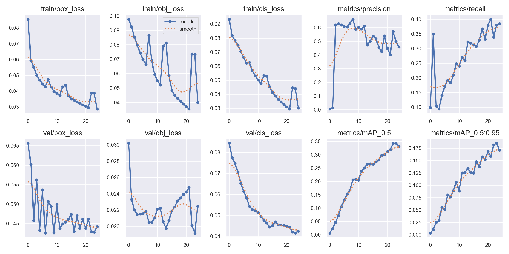
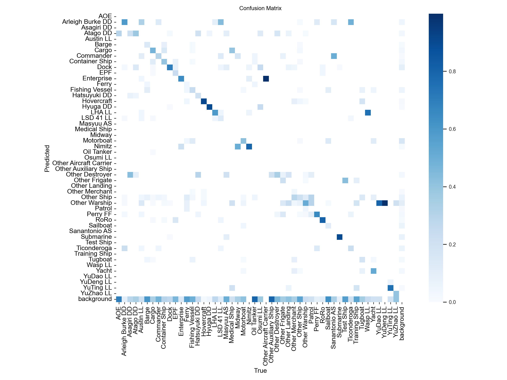
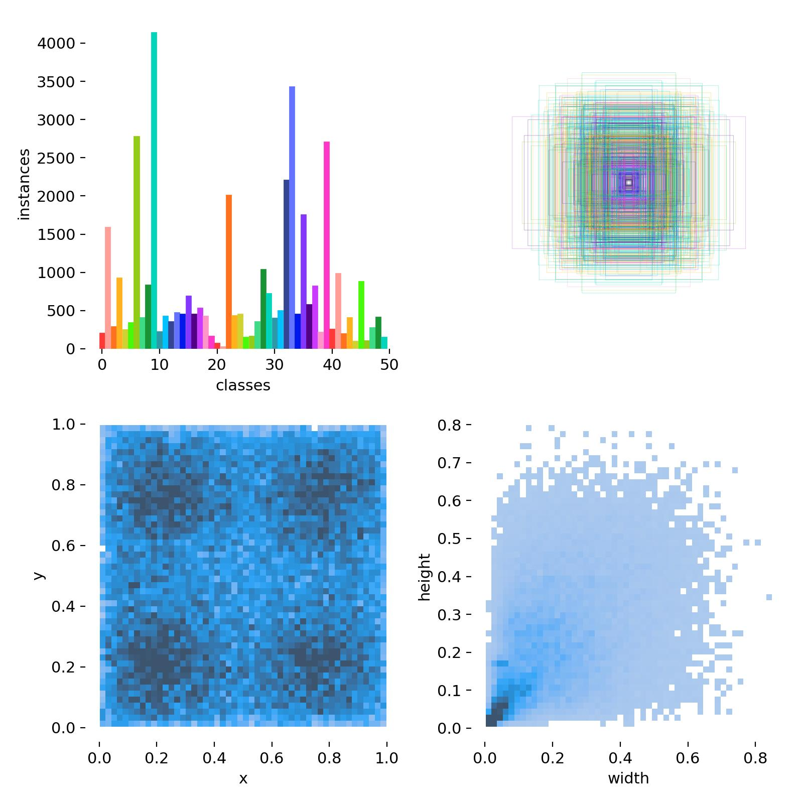

# 🚢 Naval-Ship-Detection – YOLOv5 Visualization Dashboard

An **interactive React dashboard** showcasing YOLOv5 training performance and mock detection results for naval ship detection. Designed for clarity, professionalism, and presentation-ready demos.

---

##  Features

- **Training Metrics** – Visualize precision, recall, and mAP curves generated by YOLOv5  
- **Performance Insights** – View confusion matrices and label distributions  
- **Mock Detection Interface** – Upload images and simulate detection with visual previews  
- **Responsive UI** – Clean layout, mobile-friendly, polished for dashboards

---

##  Installation & Setup

1. **Clone the repository**:
   ```bash
   git clone https://github.com/Manvitha0704/Naval-Ship-Detection.git
   cd Naval-Ship-Detection
   ```

2. **Install dependencies**:
   ```bash
   npm install
   ```

3. **Start the development server**:
   ```bash
   npm start
   ```
   Open [http://localhost:3000](http://localhost:3000) to view the dashboard.

---

##  Live Demo & Deployment

Deploy easily on **GitHub Pages**:

- **Add to `package.json`**:
  ```json
  "homepage": "https://Manvitha0704.github.io/Naval-Ship-Detection",
  "scripts": {
    "predeploy": "npm run build",
    "deploy": "gh-pages -d build"
  }
  ```

- **Deploy**:
  ```bash
  npm run deploy
  ```
  Your live dashboard will be accessible at:
  ```
  https://Manvitha0704.github.io/Naval-Ship-Detection/
  ```

---

##  Tech Stack

- **Frontend**: React (hooks), modern CSS  
- **Visual Assets**: YOLOv5 output graphs (PNG/JPEG)  
- **Hosting**: GitHub Pages for static deployment

---

##  Results

| Training Metrics | Confusion Matrix | Labels Distribution |
|------------------|-------------------|----------------------|
|  |  |  |

---

##  Notes & Contribution

- **Purpose**: Demo-ready project for visualizing YOLOv5 model behavior (for internships or portfolio)  
- **Usage**: Replace mock results with live detection backend integration when ready  
- **Contributions**: Open to enhancements—IMPROVE UI, run real model inference, add box overlays, etc.

---

##  About the Author

Built by **Manvitha**, as part of an internship project to visualize naval ship detection results using modern web interfaces and object-detection outputs.

---

**⭐ If you find this helpful, drop a star!**
